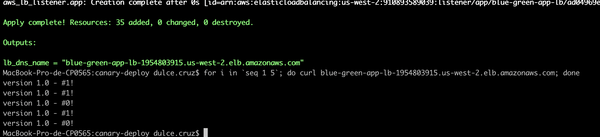

# canary-deploy

This is a poc designed to simulate a blue-green canary deployment using Terraform.

## Initializing the infrastructure

First I initialize the intra qith the command init, I used an s3 bucket as remote backend.
`terraform init`


Then I proceed to plan and deploy the configuration, note that I start just with the blue deployment for the moment.



Once this finished I get the loadbalancer dns and check that I'm able to access

As we can see, it is running the version 1.0 and evenly balancing the traffic between the instances in blue environment.

## Deploying green environment

Now that I have my base infrastructure set I'm going to deploy the green envrionment, but it will run the application version 1.1
I perform the terraform apply and create the green environmet, but this one is still not accesible because the loadbalancer is not directing traffic to it yet.


## Share traffic between the environments

We can start our canary test by starting to shift a small part of the traffic to the green environment. I do this by editing the app lb listener block and set it to forward a part of the traffic to the green env target group. I set the weight with variables, for this first test I use 90 for blue and 10 for green.

```
resource "aws_lb_listener" "app" {
  load_balancer_arn = aws_lb.app.arn
  port              = "80"
  protocol          = "HTTP"

  default_action {
    type = "forward"
    #target_group_arn = aws_lb_target_group.blue.arn

    forward {
      target_group {
        arn    = aws_lb_target_group.blue.arn
        weight = lookup(local.traffic_dist_map[var.traffic_distribution], "blue", 100)
      }
      target_group {
        arn    = aws_lb_target_group.green.arn
        weight = lookup(local.traffic_dist_map[var.traffic_distribution], "green", 0)
      }

      stickiness {
        enabled  = false
        duration = 1
      }
    }
  }
}
```

Once the changes are applied I can see that the loadbalancer is routing a part of traffic to the green environment which is running the version 1.1


## Increase traffic to green environment

Now that we can verify that the app is working as expected for version 1.1, we can increase the traffc for the green env a bit more, this time let's try 50-50.


We can continue with this process of increasing the traffic to the new version until we are sure that it is stable, then we can completely shift the traffic to the green environment and disable the blue environment until next roullout.

## Promote green env

We can continue with this process of increasing the traffic to the new version until we are sure that it is stable, then we can completely shift the traffic to the green environment and disable the blue environment until next roullout.


## Terraform documentation

<!-- BEGINNING OF PRE-COMMIT-TERRAFORM DOCS HOOK -->
## Requirements

| Name | Version |
|------|---------|
| <a name="requirement_terraform"></a> [terraform](#requirement\_terraform) | ~> 0.14 |
| <a name="requirement_aws"></a> [aws](#requirement\_aws) | >= 3.20.0 |

## Providers

| Name | Version |
|------|---------|
| <a name="provider_aws"></a> [aws](#provider\_aws) | 4.14.0 |

## Modules

| Name | Source | Version |
|------|--------|---------|
| <a name="module_app_sg"></a> [app\_sg](#module\_app\_sg) | terraform-aws-modules/security-group/aws//modules/web | 3.17.0 |
| <a name="module_lb_sg"></a> [lb\_sg](#module\_lb\_sg) | terraform-aws-modules/security-group/aws//modules/web | 3.17.0 |
| <a name="module_vpc"></a> [vpc](#module\_vpc) | terraform-aws-modules/vpc/aws | 2.64.0 |

## Resources

| Name | Type |
|------|------|
| [aws_instance.blue](https://registry.terraform.io/providers/hashicorp/aws/latest/docs/resources/instance) | resource |
| [aws_instance.green](https://registry.terraform.io/providers/hashicorp/aws/latest/docs/resources/instance) | resource |
| [aws_lb.app](https://registry.terraform.io/providers/hashicorp/aws/latest/docs/resources/lb) | resource |
| [aws_lb_listener.app](https://registry.terraform.io/providers/hashicorp/aws/latest/docs/resources/lb_listener) | resource |
| [aws_lb_target_group.blue](https://registry.terraform.io/providers/hashicorp/aws/latest/docs/resources/lb_target_group) | resource |
| [aws_lb_target_group.green](https://registry.terraform.io/providers/hashicorp/aws/latest/docs/resources/lb_target_group) | resource |
| [aws_lb_target_group_attachment.blue](https://registry.terraform.io/providers/hashicorp/aws/latest/docs/resources/lb_target_group_attachment) | resource |
| [aws_lb_target_group_attachment.green](https://registry.terraform.io/providers/hashicorp/aws/latest/docs/resources/lb_target_group_attachment) | resource |
| [aws_ami.amazon_linux](https://registry.terraform.io/providers/hashicorp/aws/latest/docs/data-sources/ami) | data source |
| [aws_availability_zones.available](https://registry.terraform.io/providers/hashicorp/aws/latest/docs/data-sources/availability_zones) | data source |

## Inputs

| Name | Description | Type | Default | Required |
|------|-------------|------|---------|:--------:|
| <a name="input_blue_instance_count"></a> [blue\_instance\_count](#input\_blue\_instance\_count) | Number of instances in blue environment | `number` | `2` | no |
| <a name="input_blue_traffic"></a> [blue\_traffic](#input\_blue\_traffic) | Level of traffic distribution to blue environment | `number` | `100` | no |
| <a name="input_enable_blue_env"></a> [enable\_blue\_env](#input\_enable\_blue\_env) | Enable blue environment | `bool` | `true` | no |
| <a name="input_enable_green_env"></a> [enable\_green\_env](#input\_enable\_green\_env) | Enable green environment | `bool` | `true` | no |
| <a name="input_enable_vpn_gateway"></a> [enable\_vpn\_gateway](#input\_enable\_vpn\_gateway) | Enable a VPN gateway in your VPC. | `bool` | `false` | no |
| <a name="input_green_instance_count"></a> [green\_instance\_count](#input\_green\_instance\_count) | Number of instances in green environment | `number` | `2` | no |
| <a name="input_green_traffic"></a> [green\_traffic](#input\_green\_traffic) | Level of traffic distribution to green environment | `number` | `0` | no |
| <a name="input_private_subnet_cidr_blocks"></a> [private\_subnet\_cidr\_blocks](#input\_private\_subnet\_cidr\_blocks) | Available cidr blocks for private subnets | `list(string)` | <pre>[<br>  "10.0.101.0/24",<br>  "10.0.102.0/24",<br>  "10.0.103.0/24",<br>  "10.0.104.0/24",<br>  "10.0.105.0/24",<br>  "10.0.106.0/24",<br>  "10.0.107.0/24",<br>  "10.0.108.0/24"<br>]</pre> | no |
| <a name="input_private_subnet_count"></a> [private\_subnet\_count](#input\_private\_subnet\_count) | Number of private subnets | `number` | `2` | no |
| <a name="input_public_subnet_cidr_blocks"></a> [public\_subnet\_cidr\_blocks](#input\_public\_subnet\_cidr\_blocks) | Available cidr blocks for public subnets | `list(string)` | <pre>[<br>  "10.0.1.0/24",<br>  "10.0.2.0/24",<br>  "10.0.3.0/24",<br>  "10.0.4.0/24",<br>  "10.0.5.0/24",<br>  "10.0.6.0/24",<br>  "10.0.7.0/24",<br>  "10.0.8.0/24"<br>]</pre> | no |
| <a name="input_public_subnet_count"></a> [public\_subnet\_count](#input\_public\_subnet\_count) | Number of public subnets | `number` | `2` | no |
| <a name="input_region"></a> [region](#input\_region) | AWS region | `string` | `"us-west-2"` | no |
| <a name="input_vpc_cidr_block"></a> [vpc\_cidr\_block](#input\_vpc\_cidr\_block) | VPC CIDR block | `string` | `"10.0.0.0/16"` | no |

## Outputs

| Name | Description |
|------|-------------|
| <a name="output_lb_dns_name"></a> [lb\_dns\_name](#output\_lb\_dns\_name) | n/a |
<!-- END OF PRE-COMMIT-TERRAFORM DOCS HOOK -->
